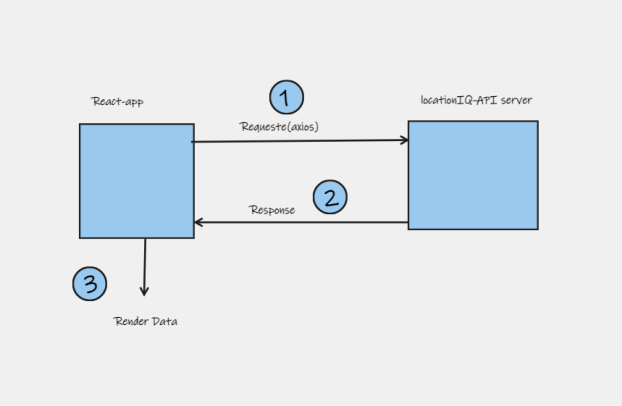

# request-response cycle for the current lab

## Data flow 
1. We are going to send request using axios in React. 
2. Recieving data from API and store it.
3. Render the data.

## Functions support data flow 
1. async and await.
2. sending request using axios.
3. render it by using any events methods.

Name of feature: map lab 06

Estimate of time needed to complete: 2

Start time: 8

Finish time: 10

Actual time needed to complete: 1 hour
